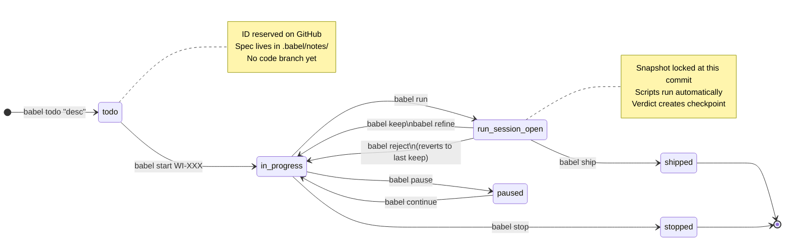
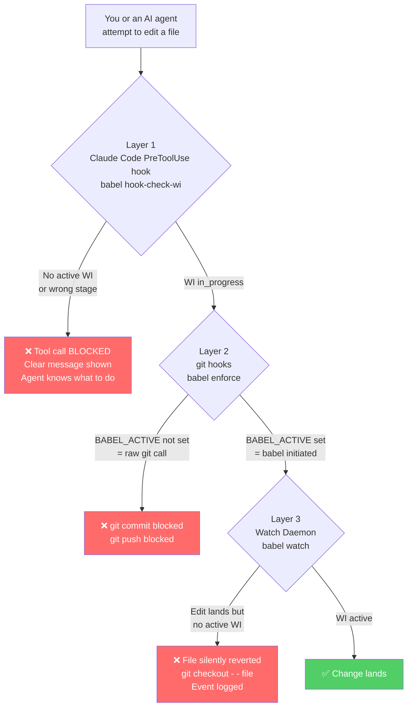
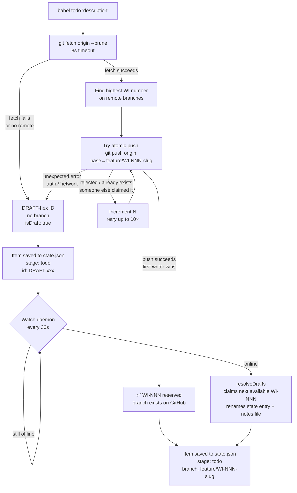
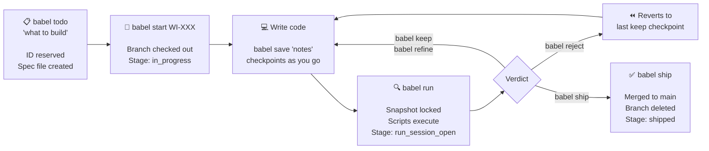
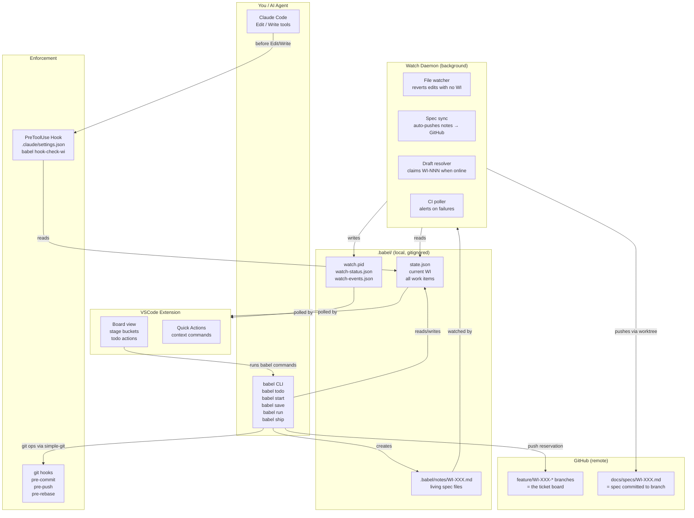

# babelgit — Process Diagrams

Visual explainers for the babelgit workflow as used in active development.

---

## 1. Work Item Lifecycle (State Machine)

---

## 2. The Enforcement Stack

Three independent layers, each catching what the others miss.

---

## 3. ID Reservation Flow (`babel todo`)

---

## 4. The Daily Development Loop

---

## 5. Component Architecture

